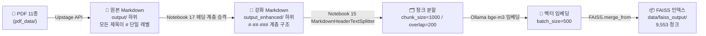
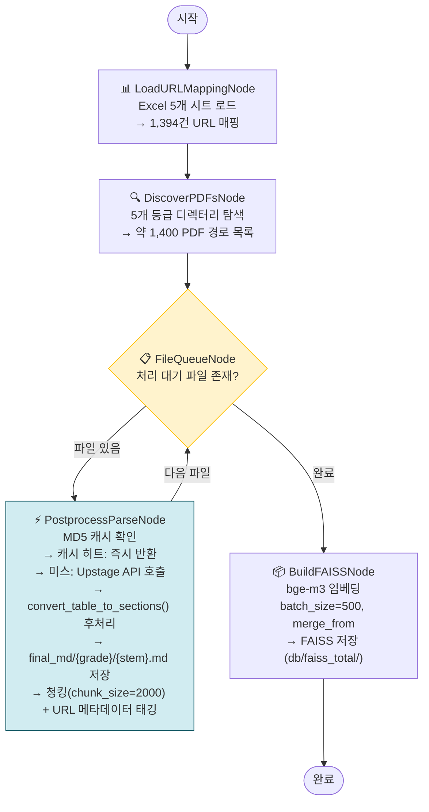

# 한국 감염병 관리 문서 파싱 및 FAISS 벡터 DB 구축

> AI 엔지니어 포트폴리오 — RAG 시스템용 지식 베이스 자동화 파이프라인

---

## 1. 프로젝트 개요

한국 질병관리청 발행 감염병 관리 PDF 약 1,400건을 자동으로 파싱하여 RAG(Retrieval-Augmented Generation) 시스템에 바로 연결할 수 있는 FAISS 벡터 DB를 구축한 프로젝트입니다.

**핵심 설계 결정: LLM 미사용**

파이프라인 전체에서 GPT·Gemini 등 생성형 LLM을 사용하지 않았습니다. 문서 파싱은 Upstage Document Parse API(OCR)에, 구조화 로직은 순수 Python 정규식·문자열 파싱에 위임하여 비용과 레이턴시를 최소화하고 재현성을 보장했습니다.

**최종 산출물:**

| 산출물 | 경로 | 설명 |
|---|---|---|
| 11개 카테고리별 FAISS 인덱스 | `data/faiss_output/{category}/` | 9,553 청크 |
| 전체 질병 통합 FAISS 인덱스 | `db/faiss_total/` | 1,693 청크 |

---

## 2. 기술 스택

| 영역 | 기술 |
|---|---|
| 문서 파싱 (OCR) | Upstage Document Parse API (`document-parse`) |
| 파이프라인 오케스트레이션 | LangGraph (`StateGraph` + `MemorySaver` 체크포인트) |
| 텍스트 청킹 | LangChain `MarkdownHeaderTextSplitter`, `RecursiveCharacterTextSplitter` |
| 임베딩 | Ollama `bge-m3` (로컬 서빙) |
| 벡터 스토어 | FAISS (`langchain-community`) |
| 후처리 | 순수 Python (`re`, `BeautifulSoup`) |
| 파일 처리 | `openpyxl`, `pathlib`, NFC 유니코드 정규화 |

---

## 3. 파이프라인 A: 11개 카테고리 FAISS (`data/faiss_output/`)

카테고리별 관리 지침서 11종을 각각 독립적인 FAISS 인덱스로 구축하는 파이프라인입니다.

### 아키텍처



### 구현 상세

**Step 1 — 헤딩 계층 승격 (Notebook 17)**

Upstage API는 모든 제목을 `#` 단일 레벨로 반환합니다. 순수 정규식으로 내용 패턴을 분류하여 H1/H2/H3 계층을 부여했습니다.

| 규칙 | 패턴 예시 | 승격 결과 |
|---|---|---|
| 장(章) 구분 | `제N장`, `CHAPTER`, `Part` | `#` (H1) |
| 번호 제목 | `N. 텍스트`, `가. 텍스트` | `##` (H2) |
| 하위 항목 | `N) 텍스트`, `◦`, `○`, `-` | `###` (H3) |

결과: 11개 파일에서 H1 2,426개 + H2 2,740개 + H3 4,106개 생성

**Step 2 — FAISS 구축 (Notebook 15)**

```python
# 헤더 기반 1차 분할 → 길이 초과 시 2차 분할
splitter = MarkdownHeaderTextSplitter(
    headers_to_split_on=[("#", "h1"), ("##", "h2"), ("###", "h3")],
    strip_headers=False,
)
char_splitter = RecursiveCharacterTextSplitter(
    chunk_size=1000, chunk_overlap=200
)

# 메타데이터: category, source_file, section_h1, section_h2, section_h3, chunk_index
```

---

## 4. 파이프라인 B — 통합 FAISS (LangGraph, `db/faiss_total/`)

~1,400개 PDF를 LangGraph 5노드 그래프로 처리하는 파이프라인입니다. `PostprocessParseNode`를 활용하여 `convert_table_to_sections()` 후처리 + `final_md/` 저장 + chunk_size=2000을 적용한 파이프라인(`13-14-LangGraph-PostProcess-FAISS.ipynb`)이 최종 결과물인 `db/faiss_total/`을 생성했습니다.

### 아키텍처



### `PostprocessParseNode` 핵심 구현

```python
def __call__(self, state: PostprocessBulkState) -> dict:
    filepath = state["current_path"]
    filename = _nfc(os.path.basename(filepath))
    stem     = Path(filename).stem

    # grade: pdf_files/1급감염병/origin_pdf/파일명.pdf → "1급감염병"
    grade = _nfc(os.path.basename(os.path.dirname(os.path.dirname(filepath))))

    # ... Upstage API 호출 후 raw_md 조합 ...

    # ── 핵심: 후처리 ──────────────────────────────────────────────────
    processed_md = convert_table_to_sections(raw_md, source_filename=filename)

    # final_md/{grade}/{stem}.md 저장 (resume 지원)
    final_md_path = Path(final_md_root) / grade / f"{stem}.md"
    final_md_path.parent.mkdir(parents=True, exist_ok=True)
    final_md_path.write_text(processed_md, encoding="utf-8")
    # ──────────────────────────────────────────────────────────────────

    # 청킹 (chunk_size=2000)
    chunks = self.splitter.split_text(processed_md)
    ...
```

### `convert_table_to_sections()` — `layoutparse/postprocessor.py`

Upstage API가 `| 구분 | 내용 |` 형식의 2열 표로 반환하는 질병 문서를 `## {구분}` 섹션 구조로 변환합니다.

```python
# 입력 (Upstage 원본)
# | 구분 | 내용 |
# |---|---|
# | 감염병 분류 | ◦ 제1급 법정감염병 |
# | 병원체 | 에볼라바이러스속 |

# 출력 (구조화 Markdown)
# # 에볼라바이러스병_질병개요
# ## 감염병 분류
# ◦ 제1급 법정감염병
# ## 병원체
# 에볼라바이러스속
result = convert_table_to_sections(raw_md, source_filename="에볼라바이러스병_질병개요.pdf")
```

### URL 매핑 메타데이터 전략

RAG 시스템에서 검색 결과를 반환할 때 원본 문서 URL을 함께 제공하기 위해, PDF 파일명과 URL을 연결하는 매핑 테이블을 사전에 구성했습니다.

**매핑 소스:** `URL(수정)_도훈_with_PDF.xlsx` — 5개 시트(질병 등급별), 총 1,394행

| 열 | 내용 |
|---|---|
| 질병명 | 한국어 질병 이름 |
| 구분 | 문서 종류 (질병개요, 역학조사, 진단기준 등) |
| URL | 질병관리청 원본 문서 URL |
| PDF 파일명 | 로컬 PDF 파일명 (매핑 키) |

파싱 후 각 청크에 다음 메타데이터가 부착됩니다:

```python
metadata = {
    "source_url": "https://...",  # RAG 응답 시 출처 링크 제공
    "disease":    "에볼라바이러스병",
    "category":   "1급",           # 시트명 = 질병 등급
    "doc_type":   "질병개요",
    "source_file": "에볼라바이러스병_질병개요.pdf",
    "chunk_index": 0,
}
```

**파일명 매칭 전략 (3단계 폴백)**

Excel의 파일명과 로컬 파일명이 완전히 일치하지 않는 경우(공백, 확장자 차이 등)를 위해 3단계 폴백 룩업을 적용했습니다:

```
1. 정확 매칭: "에볼라바이러스병_질병개요.pdf" == Excel 파일명
2. 공백 제거 후 매칭: "에볼라바이러스병 _질병개요.pdf" → strip() → 재시도
3. 미스: source_url = "" (빈 문자열로 저장)
```

---

## 5. 핵심 구현 아이디어

### 5-1. 헤딩 계층 승격 (순수 정규식)

Upstage API의 단일 레벨 `#` 출력을 실제 문서 계층으로 복원했습니다. LLM 없이 패턴 매칭만으로 2,426개 H1 + 2,740개 H2 + 4,106개 H3를 정확히 분류했습니다.

```python
H1_PATTERNS = [
    re.compile(r"^제\s*\d+\s*장"),     # 제1장, 제2장
    re.compile(r"^(CHAPTER|Part)\b"),   # 영문 장 구분
    re.compile(r"^\d+$"),               # 순수 숫자 (독립 번호)
]
H2_PATTERNS = [
    re.compile(r"^\d+[\.\s]+\S"),       # "1. 텍스트", "1 텍스트"
    re.compile(r"^[가-힣]\.\s"),         # "가. 텍스트"
]
H3_PATTERNS = [
    re.compile(r"^\d+\)\s"),            # "1) 텍스트"
    re.compile(r"^[가-힣]\)\s"),         # "가) 텍스트"
    re.compile(r"^[◦○\*\-<\[]"),        # 불릿 기호
]
```

### 5-2. MD5 기반 재개 가능 캐싱

API 비용이 발생하는 Upstage 호출을 MD5 해시 키로 캐싱하여 중단 후 재개를 안전하게 지원합니다. 1,400개 파일 처리 중 어느 시점에 중단되더라도 캐시 히트로 이미 처리한 파일을 건너뜁니다.

```python
@staticmethod
def _cache_path(filepath: str) -> Path:
    # 파일 경로의 MD5로 캐시 키 생성 (파일명 변경에도 안전)
    md5 = hashlib.md5(_nfc(filepath).encode("utf-8")).hexdigest()
    return BULK_CACHE_DIR / f"{md5}.pkl"

def execute(self, state):
    cached = self._load_cache(filepath)
    if cached is not None:
        return {"documents": cached, ...}   # API 호출 없이 즉시 반환
    # ... Upstage API 호출 후 캐시 저장
    self._save_cache(filepath, docs)
```

### 5-3. FAISS 배치 병합으로 OOM 방지

대규모 문서 집합을 한 번에 임베딩하면 메모리가 부족합니다. `FAISS.from_documents()` + `db.merge_from()`으로 배치 단위 처리 후 점진적으로 인덱스를 병합했습니다.

```python
batch_size = 500
db = None
for i in range(0, len(docs), batch_size):
    batch = docs[i : i + batch_size]
    if db is None:
        db = FAISS.from_documents(batch, embeddings)    # 최초 생성
    else:
        batch_db = FAISS.from_documents(batch, embeddings)
        db.merge_from(batch_db)                          # 점진적 병합

db.save_local(output_dir)
```

---

## 6. 결과물

**파이프라인 A — 11개 카테고리 FAISS (`data/faiss_output/`)**

| 항목 | 수치 |
|---|---|
| 입력 PDF | 11종 (카테고리별 관리 지침서) |
| 헤딩 계층 생성 | H1 2,426 + H2 2,740 + H3 4,106 |
| chunk_size / overlap | 1,000 / 200 |
| FAISS 인덱스 수 | 11개 (`data/faiss_output/{category}/`) |
| 총 청크 수 | 9,553 청크 |
| 임베딩 모델 | Ollama `bge-m3` (1024차원, 로컬) |

**파이프라인 B — 통합 FAISS (`db/faiss_total/`)**

| 항목 | 수치 |
|---|---|
| 입력 PDF | ~1,400개 (1급/2급/3급/4급/NOS 5등급) |
| 후처리 | `convert_table_to_sections()` + `final_md/` 저장 |
| chunk_size / overlap | 2,000 / 200 |
| FAISS 인덱스 수 | 1개 (`db/faiss_total/`) |
| 총 청크 수 | 1,693 청크 |
| 임베딩 모델 | Ollama `bge-m3` (1024차원, 로컬) |

---

## 7. 학습 및 성과 요약

**기술적 학습**

- **LangGraph 조건부 라우팅**: `add_conditional_edges`로 파일 큐 루프를 구현하고, `MemorySaver` 체크포인트로 장시간 배치 작업의 중단·재개를 안전하게 처리하는 패턴을 익혔습니다.
- macOS 한국어 파일명 NFC/NFD 이슈 해결
- **FAISS 메모리 관리**: 대규모 임베딩 작업에서 배치 분할 + `merge_from()` 패턴이 OOM 없이 안정적으로 동작함을 검증했습니다.

**설계 결정의 효과**

- LLM 미사용으로 API 비용을 예측 가능하게 통제하고, 동일 입력에 대한 완전한 재현성을 확보했습니다.
- MD5 캐싱으로 Upstage API 재호출 없이 파이프라인을 여러 번 반복 실행할 수 있어 개발·디버깅 비용을 크게 줄였습니다.
- `MarkdownHeaderTextSplitter`를 헤딩 계층이 실제로 존재하는 Markdown에 적용하여 청크가 문서 구조를 보존하도록 했고, 이는 RAG 검색 품질 향상에 직결됩니다.
