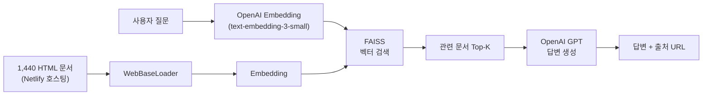
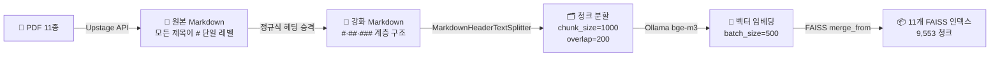
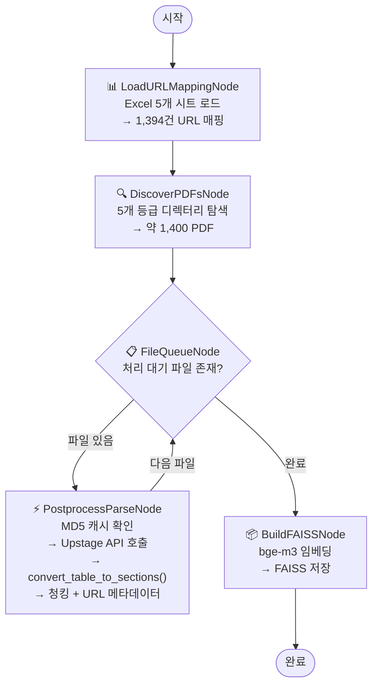
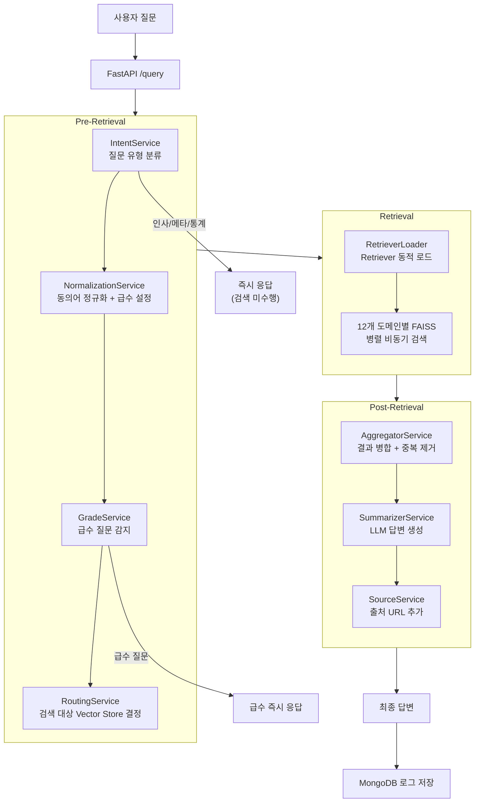
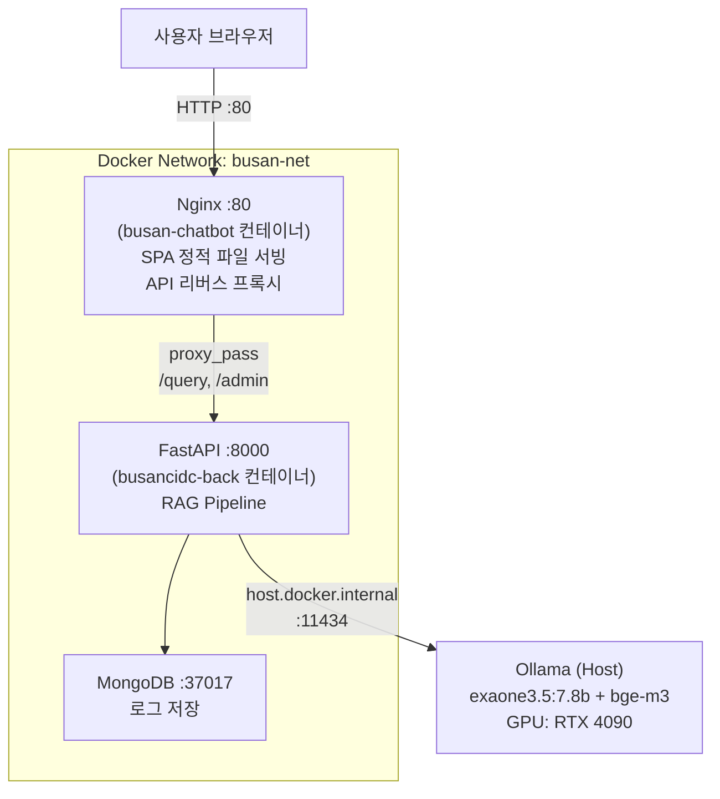

# RAG 기반 법정감염병 안내 AI 챗봇 — IDBOT

| 항목 | 내용 |
|------|------|
| **프로젝트명** | 부산광역시 감염병관리지원단 위탁 RAG 챗봇 |
| **기간** | 2024.06 ~ 2025.12 (2개년) |
| **역할** | AI Engineer |
| **배포 URL** | http://idbot.or.kr |
| **누적 사용** | 3,000건+ |

---

## 1. 프로젝트 배경과 문제 정의

부산광역시 감염병관리지원단은 매년 **법정감염병 알아보기** 핸드북을 발간하여 전국 의료기관에 배포합니다. 그러나 144종에 달하는 감염병 정보를 수백 페이지 문서에서 수동 검색하는 것은 긴급한 의료 현장에서 비효율적이었습니다.

### 발주처 3대 요구사항

| # | 요구사항 | 난이도 |
|---|----------|--------|
| 1 | 144종 법정감염병 최신 지침서 내용을 **100% 반영** | 데이터 엔지니어링 |
| 2 | 답변 시 공식 문서의 **출처 URL**을 반드시 표기 | 메타데이터 설계 |
| 3 | **할루시네이션 방지** — 제공 문서 범위 내에서만 답변 | 프롬프트 + RAG 설계 |

### RAG가 적합한 이유

의료 도메인에서 LLM을 단독 사용하면 할루시네이션 위험이 높습니다. RAG(Retrieval-Augmented Generation)는 검색된 문서만을 근거로 답변을 생성하므로, 출처 추적과 할루시네이션 억제를 구조적으로 보장할 수 있습니다.

---

## 2. 1차년도 (2024) — IDBOT v1

### 2-1. 팀 구성과 역할

- **팀 구성**: 대학원생 2명 + 학부생 5명
- **본인 역할 (AI Engineer)**:
  - RAG 파이프라인 설계 및 구축 (LangChain, FAISS, 프롬프트 엔지니어링)
  - 문서 전처리 파이프라인 설계 — 1,440개 데이터 원자화 전략 수립
  - FastAPI 비동기 백엔드 API 서버 개발 및 MongoDB 연동
  - Docker 컨테이너화 및 서버 배포 관리
  - 학부생 5명의 데이터 변환 작업을 위한 가이드라인 작성 및 프로세스 리딩

### 2-2. 시스템 아키텍처 — Naive RAG



1차년도에는 질문을 임베딩하여 FAISS에서 유사 문서를 검색하고, 이를 컨텍스트로 LLM에 전달하는 **Naive RAG** 구조를 채택했습니다.

### 2-3. 데이터 전처리 — 1,440 HTML 원자화

144종 질병 × 10개 카테고리(질병개요, 증상, 치료 등) = **1,440개 독립 HTML 문서**로 분절했습니다. 각 문서는 Netlify를 통해 개별 URL을 부여받아, 챗봇이 답변 시 직접적인 웹 링크 출처를 제공하는 기반이 되었습니다.

### 2-4. 기술 스택

| 영역 | 기술 |
|------|------|
| LLM | OpenAI GPT API |
| Embedding | OpenAI text-embedding-3-small |
| Vector DB | FAISS |
| Backend | FastAPI + Uvicorn |
| Database | MongoDB |
| 배포 | Docker |
| 프레임워크 | LangChain |
| 호스팅 | Netlify (HTML 문서) |

### 2-5. 프롬프트 엔지니어링

의료 정보의 정확성을 유지하기 위해 다음 전략을 수립했습니다.

- **검색 기반 답변 강제**: "반드시 Retriever에 검색된 문서만을 활용할 것"이라는 강한 제약을 두어 외부 지식 혼입을 차단
- **출처 표기**: Markdown `References` 섹션에 URL을 명시하도록 지시
- **방어적 태도**: 적절한 답변을 찾지 못한 경우 "잘 모르겠습니다"로 응답하여 정보 왜곡 방지

### 2-6. 성과

- 부산광역시 감염병관리지원단 주관 발표회에서 공식 시연 완료
- 누적 사용량 **3,000건** 돌파
- 단순 LLM(ChatGPT) 대비 Answer Relevancy **65% → 75%** (약 10% 향상)

### 2-7. 발견된 3가지 한계 — 2차년도 과제

| # | 한계 | 원인 | 영향 |
|---|------|------|------|
| 1 | **표 구조 손실** | `WebBaseLoader`가 HTML 표를 텍스트로 평면화 | 핵심 정보인 표 데이터가 컨텍스트에서 왜곡 → 답변 품질 저하 |
| 2 | **동의어 미처리** | "신종플루" ↔ "신종인플루엔자 A" 등 매핑 부재 | 동의어 질문 시 엉뚱한 문서 검색 |
| 3 | **API 비용** | OpenAI API 종량제 의존 | 운영 비용 예측 불가, 장기 운영 부담 |

> 이 3가지 한계가 2차년도 프로젝트의 핵심 과제가 되었습니다.

---

## 3. 2차년도 (2025) — 성능 개선

### 3-1. 문제 → 해결 매핑

| 1차년도 문제 | 2차년도 해결 |
|-------------|-------------|
| 표 구조 손실 | Upstage Document Parse API + `convert_table_to_sections()` 후처리로 구조 보존 |
| 동의어 미처리 | 142종 동의어 사전 구축 + `NormalizationService` |
| API 비용 | 로컬 LLM(Ollama exaone3.5:7.8b) + 로컬 임베딩(bge-m3)으로 전환 |
| Naive RAG 한계 | Advanced RAG 3단계 파이프라인 설계 |

### 3-2. 문서 전처리 파이프라인

> **핵심 설계 결정: LLM 호출 0회, 완전한 재현성**
>
> 파이프라인 전체에서 GPT·Gemini 등 생성형 LLM을 사용하지 않았습니다. 문서 파싱은 Upstage Document Parse API(OCR)에, 구조화 로직은 순수 Python 정규식·문자열 파싱에 위임하여 비용과 레이턴시를 최소화하고 동일 입력에 대한 완전한 재현성을 보장했습니다.

#### Pipeline A: 11개 카테고리별 FAISS (9,553 청크)

카테고리별 관리 지침서 11종을 각각 독립적인 FAISS 인덱스로 구축하는 파이프라인입니다.



**헤딩 계층 승격** — Upstage API는 모든 제목을 `#` 단일 레벨로 반환합니다. 순수 정규식으로 내용 패턴을 분류하여 H1/H2/H3 계층을 부여했습니다.

```python
H1_PATTERNS = [re.compile(r"^제\s*\d+\s*장"), ...]   # 장(章) 구분
H2_PATTERNS = [re.compile(r"^\d+[\.\s]+\S"), ...]     # 번호 제목
H3_PATTERNS = [re.compile(r"^\d+\)\s"), ...]           # 하위 항목
# 결과: H1 2,426 + H2 2,740 + H3 4,106 생성
```

#### Pipeline B: 통합 FAISS — LangGraph (1,693 청크)

약 1,400개 PDF를 LangGraph 5노드 그래프로 처리하는 파이프라인입니다.



**핵심 후처리 — `convert_table_to_sections()`**: Upstage API가 반환하는 2열 표(`| 구분 | 내용 |`)를 `## {구분}` 섹션 구조로 변환하여 청킹 시 의미 단위가 보존되도록 했습니다.

```python
# 입력: | 감염병 분류 | ◦ 제1급 법정감염병 |
# 출력: ## 감염병 분류\n◦ 제1급 법정감염병
```

**MD5 기반 캐싱**: API 호출 결과를 MD5 해시 키로 캐싱하여 중단 후 재개를 안전하게 지원합니다. 1,400개 파일 처리 중 어느 시점에 중단되더라도 캐시 히트로 기처리 파일을 건너뜁니다.

### 3-3. 동의어 사전 — NormalizationService

142종 감염병에 대한 동의어·약칭 매핑 사전(`disease_metadata.csv`)을 구축했습니다. `NormalizationService`가 사용자 질문에서 동의어를 감지하면 정규 병명으로 변환하고, 해당 감염병의 급수(1~4급) 정보도 함께 설정합니다.

| 사용자 입력 | 정규화 결과 | 급수 |
|------------|------------|------|
| 신종플루 | 신종인플루엔자 A(H1N1) | 4급 |
| 원숭이두창 | 엠폭스(Mpox) | 2급 |
| 코로나 | 코로나바이러스감염증-19 | 4급 |

### 3-4. Advanced RAG 파이프라인 아키텍처

1차년도의 Naive RAG에서 벗어나, **Pre-Retrieval → Retrieval → Post-Retrieval** 3단계 파이프라인을 설계했습니다.



**Pre-Retrieval 단계**에서 불필요한 벡터 검색을 차단하여 레이턴시를 줄이고, **Retrieval 단계**에서 도메인별 12개 FAISS 인덱스를 병렬 비동기 검색하여 정확도를 높이며, **Post-Retrieval 단계**에서 결과를 병합·요약·출처 태깅하여 최종 답변을 생성합니다.

| 단계 | 구성 요소 | 역할 |
|------|----------|------|
| Pre-Retrieval | IntentService | 질문 유형 분류 (인사 / 챗봇 정보 / 통계 / 질병 질의) |
| | NormalizationService | 동의어·약칭 → 정규 병명 변환 + 급수 설정 |
| | GradeService | 급수 관련 질문 감지 시 즉시 응답 |
| | RoutingService | 키워드 분석 → 검색 대상 Vector Store 결정 |
| Retrieval | RetrieverLoader | 라우팅 결과에 따라 Retriever 동적 로드 |
| | FAISS × 12 | 도메인별 인덱스에서 유사 문서 병렬 검색 |
| Post-Retrieval | AggregatorService | 복수 Retriever 결과 병합 + 중복 제거 |
| | SummarizerService | Ollama exaone3.5:7.8b로 최종 답변 생성 |
| | SourceService | 답변에 출처 URL 추가 |

### 3-5. 프론트엔드

React 19 + Vite 기반의 SPA로 구현했습니다.

| 라우트 | 페이지 | 설명 |
|--------|--------|------|
| `/` | ChatPage | 메인 챗봇 UI |
| `/admin` | AdminPage | 관리자 로그 뷰어 (토큰 인증) |
| `/popup` | PopupPage | 업데이트 공지 팝업 |

- **반응형 디자인**: 1024px / 768px / 480px 3단계 브레이크포인트
- **Markdown 렌더링**: `react-markdown` + `remark-gfm`으로 봇 응답을 Markdown으로 렌더링
- **라우팅**: `react-router-dom` v7 기반 클라이언트 사이드 라우팅

### 3-6. 배포 아키텍처

Ubuntu 22.04 서버(RTX 4090)에 Docker 기반으로 배포했습니다.



| 컨테이너 | 역할 | 포트 |
|----------|------|------|
| busan-chatbot | Nginx + React SPA | 80 |
| busancidc-back | FastAPI + RAG Pipeline | 8000 |
| mongodb | 쿼리 로그 저장 | 37017 |
| Ollama (Host) | LLM + 임베딩 서빙 (GPU) | 11434 |

- **Cross-platform 빌드**: Mac(Apple Silicon)에서 `docker buildx --platform linux/amd64`로 서버용 이미지 빌드
- **Nginx 타임아웃**: LLM 응답 시간을 고려하여 `proxy_*_timeout 600`으로 설정
- **NVIDIA 드라이버 버전 고정**: `apt-mark hold`로 자동 업데이트에 의한 커널 모듈 불일치 방지

### 3-7. 관측성 (Observability)

| 도구 | 용도 |
|------|------|
| **MongoDB 로깅** | 모든 질의·응답을 저장하여 사용 패턴 분석 |
| **관리자 대시보드** | 감염병관리지원단이 기간별 누적 질문 수·내용을 조회 |
| **Langfuse 트레이싱** | RAG 파이프라인 각 단계의 레이턴시·토큰 사용량 모니터링 |

---

## 4. 정량적 성과 비교

| 지표 | 1차년도 (2024) | 2차년도 (2025) | 변화 |
|------|---------------|---------------|------|
| **Answer Relevancy** | 75% | ~80% | +5%p |
| **Faithfulness** | - | +5%p 향상 | 측정 체계 도입 |
| **API 비용** | OpenAI 종량제 | 로컬 LLM (0원) | 운영 비용 제거 |
| **동의어 처리** | 미지원 | 142종 매핑 | 신규 도입 |
| **벡터 DB 규모** | 1,440 문서 (단일) | 11,246 청크 (12개 인덱스) | 7.8× 확대 |
| **문서 구조 보존** | 표 → 평문 손실 | 표 → 섹션 변환 보존 | 핵심 개선 |
| **관측성** | MongoDB 로그만 | Langfuse + 대시보드 | 체계 구축 |

---

## 5. 기술적 회고

### 잘한 점

- **LLM 미사용 전처리**: 정규식 기반 파이프라인으로 비용 0원, 완전한 재현성을 확보했습니다. 동일 입력에 대해 항상 같은 결과를 보장하므로 디버깅과 품질 관리가 용이합니다.
- **멀티 리트리버 구조**: 12개 도메인별 FAISS 인덱스를 병렬 비동기 검색하여, 단일 인덱스 대비 검색 정확도를 높이면서도 레이턴시를 관리할 수 있었습니다.
- **Langfuse 도입**: RAG 파이프라인의 각 단계를 트레이싱하여 병목 구간을 정량적으로 파악하고 개선할 수 있는 기반을 마련했습니다.
- **1차 → 2차 서사 구조**: 1차년도에 발견한 문제를 2차년도에 체계적으로 해결하는 과정을 통해 기술적 깊이를 확보했습니다.

### 향후 개선 방향

- **평가 자동화**: RAGAS 등 프레임워크를 활용한 자동 평가 파이프라인 구축
- **스트리밍 응답**: 현재 일괄 응답 방식을 SSE/WebSocket 기반 스트리밍으로 전환하여 UX 개선
- **멀티턴 대화**: 대화 컨텍스트를 유지하는 멀티턴 RAG 파이프라인 설계

---

## 6. 기술 스택 총정리

| 영역 | 1차년도 (2024) | 2차년도 (2025) |
|------|---------------|---------------|
| **LLM** | OpenAI GPT API | Ollama exaone3.5:7.8b (로컬) |
| **Embedding** | OpenAI text-embedding-3-small | Ollama bge-m3 (로컬, 1024차원) |
| **Vector DB** | FAISS (단일) | FAISS × 12 (도메인별) |
| **문서 파싱** | WebBaseLoader (HTML) | Upstage Document Parse API (PDF) |
| **파이프라인** | LangChain | LangChain + LangGraph |
| **Backend** | FastAPI + Uvicorn | FastAPI + Uvicorn |
| **Database** | MongoDB | MongoDB |
| **Frontend** | 기본 웹 인터페이스 | React 19 + Vite + React Router v7 |
| **배포** | Docker | Docker + Nginx + Ollama (RTX 4090) |
| **관측성** | MongoDB 로그 | Langfuse + MongoDB + 관리자 대시보드 |
| **전처리** | 수동 HTML 분절 (1,440개) | 자동화 파이프라인 (정규식 + LangGraph) |
| **동의어** | 미지원 | disease_metadata.csv (142종) |
